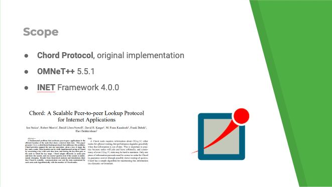
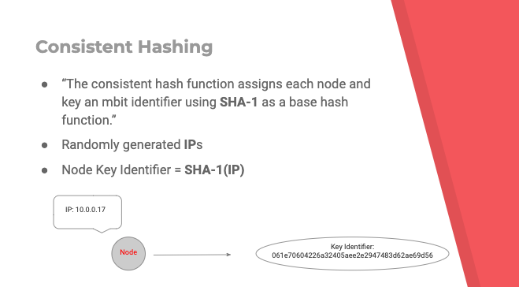
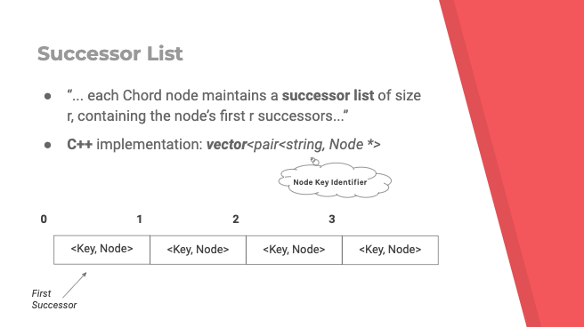
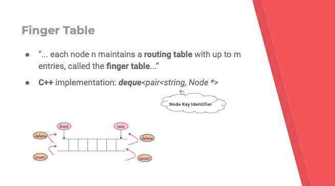

# Chord - Omnet++
## Overview
This is an optional project for the [Distributed System](https://www11.ceda.polimi.it/schedaincarico/schedaincarico/controller/scheda_pubblica/SchedaPublic.do?&evn_default=evento&c_classe=694795&polij_device_category=DESKTOP&__pj0=0&__pj1=a23fc3e2601cfd6774f57798f3caec50) course at Politecnico di Milano. It is an Omnet++ implementation of the Chord P2P protocol as discussed in its [original paper](https://pdos.csail.mit.edu/papers/ton:chord/paper-ton.pdf), also including the protocols to stabilize the network when new peers join or leave.

  

## Implementation
I'm not gonna dive into the protocols details, I assume that if you are reading this README you perfectly know what the protocol does. In this section I wanted to only give an overview of how the various aspects of the protocol have been *implemented*.

### Consistent Hashing

  

IP addresses are randomly generated and each IP address is associated to a unique node, which has its unique identifier given by the SHA-1 hash of the IP.

### Successor List

  

The *successor list* has been treated as a vector of pairs: the key identifier and the node.

### Finger Table

  

For the *finger table* we decided to use a deque, as we saw an similar implementation in the [OverSim](https://github.com/inet-framework/oversim/tree/master/src/overlay/chord) project and we really liked it.

# Authors
- [Matteo Moreschini](https://github.com/teomores)
- [Alberto Rossettini](https://github.com/albeRoss)

# License
This project is licensed under the MIT License.

# External Resources
- Original [Chord paper](https://pdos.csail.mit.edu/papers/ton:chord/paper-ton.pdf)
- Other [Chord paper](https://pdos.csail.mit.edu/papers/chord:sigcomm01/chord_sigcomm.pdf)
- [OverSim implementation](https://github.com/inet-framework/oversim/tree/master/src/overlay/chord)
- Distributed Systems course P2P [slides](http://corsi.dei.polimi.it/distsys/pub/07-p2p.pdf)
